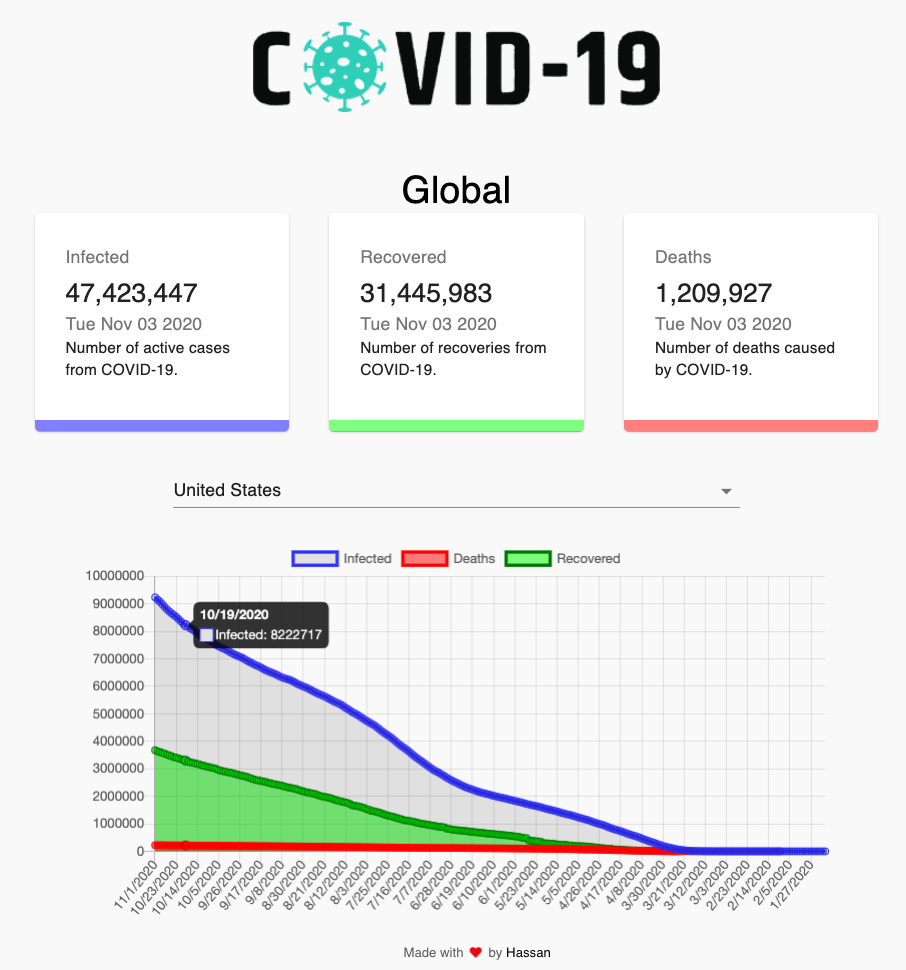

# USCovidTracker.org

> A web app that tracks the number of Covid-19 cases in the United States, broken down by state.

### [Live Site](https://uscovidtracker.org/)

### Technologies

This project uses:

- React
- JavaScript
- Charts.js
- Material UI

API used: https://api.covidtracking.com

### Setup

1. Clone the github repo
2. Run `npm install` in the terminal
3. Run `npm start` to launch a local demo

### Credit

Thank you to JavaScript Mastery for the [video tutorial](https://www.youtube.com/watch?v=khJlrj3Y6Ls&ab_channel=JavaScriptMastery).
